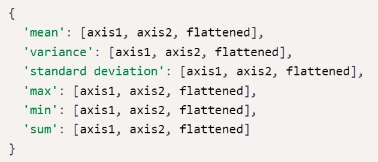
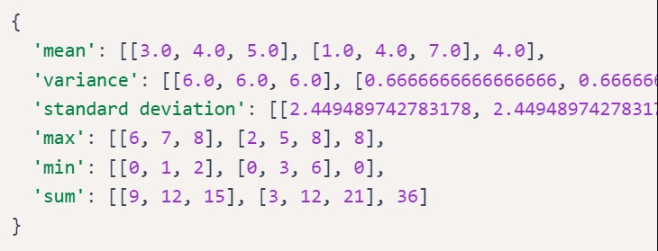
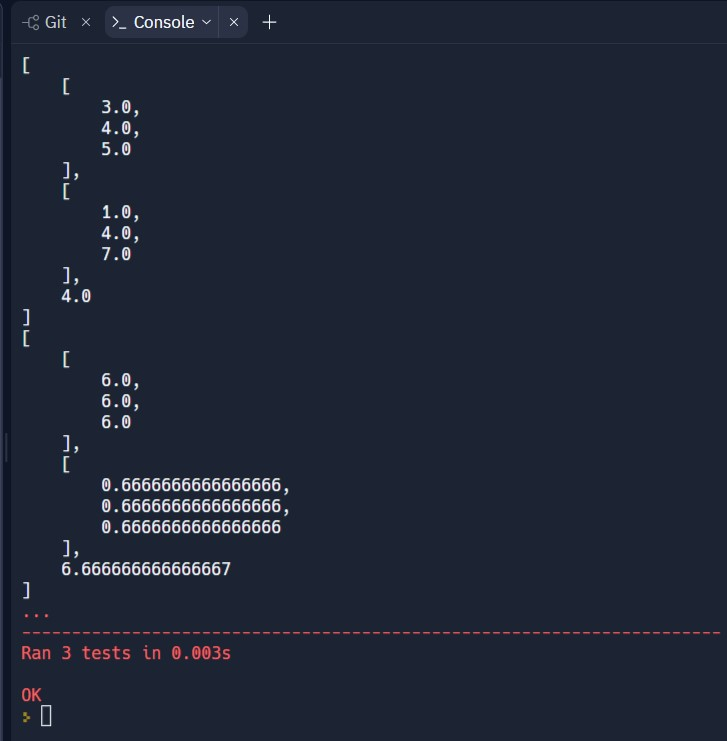

# Mean-Variance-Standard Deviation Calculator

#### Documentation can be found on : [https://github.com/viktoriussuwandi/Mean-Variance-Standard-Deviation-Calculator](https://github.com/viktoriussuwandi/Mean-Variance-Standard-Deviation-Calculator)

This is the complete Mean-Variance-Standard Deviation Calculator project. 
Instructions for building the project can be found at 
https://www.freecodecamp.org/learn/data-analysis-with-python/data-analysis-with-python-projects/mean-variance-standard-deviation-calculator

### Some of additional features :
    * split into different detail functions

### Description :
Create a function named `calculate()` in `mean_var_std.py` that uses Numpy to output the mean, variance, standard deviation, max, min, and sum of the rows, columns, and elements in a 3 x 3 matrix.

The input of the function should be a list containing 9 digits. The function should convert the list into a 3 x 3 Numpy array, and then return a dictionary containing the mean, variance, standard deviation, max, min, and sum along both axes and for the `flattened matrix`.

The returned dictionary should follow this format:

If a list containing less than 9 elements is passed into the function, it should raise a `ValueError` exception with the message: "List must contain nine numbers." The values in the returned dictionary should be lists and not Numpy arrays.

For example, `calculate([0,1,2,3,4,5,6,7,8])` should return:

The unit tests for this project are in `test_module.py`.

### Development
For development, you can use `main.py` to test your `calculate()` function. Click the "run" button and `main.py` will run.

### Testing
We imported the tests from `test_module.py` to `main.py` for your convenience. The tests will run automatically whenever you hit the "run" button.

#### Test Result

